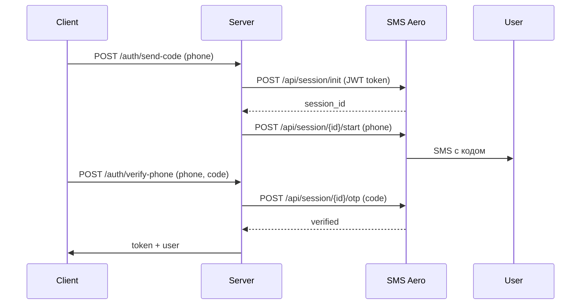

# SMS Aero — интеграция

## Статус
- ✅ **Mobile Auth (MobileID)** настроен и работает
- ✅ Тестовый режим — код пишется в лог
- При выключении тестового режима SMS будет отправляться реально через SMS Aero

## Учётные данные (`.env`)
```env
SMS_AERO_EMAIL=frederol123@gmail.com
SMS_AERO_API_KEY=***
SMS_AERO_SIGN=KodBessmert

# SMS Aero Mobile Auth (MobileID)
SMS_AERO_MOBILE_CLIENT_ID=ba55a981-d764-4588-9112-247aaf8ee016
SMS_AERO_MOBILE_CLIENT_SECRET=***
SMS_AERO_MOBILE_APP_NAME=immortal-code
SMS_AERO_MOBILE_TEST_MODE=true
```

## Как работает MobileID

### Архитектура
SMS Aero MobileID (мобильная авторизация) — OAuth-подобный сервис, который отправляет SMS с кодом подтверждения от имени SMS Aero (не требует подписи sign).



### Аутентификация (JWT)
- JWT подписывается `mobile_client_secret` через HS256
- Payload: `sub` (client_id), `iat`, `exp` (5 мин), `client_id`, `app_name`
- JWT передаётся в HTTP-запросах через Bearer token

### API эндпоинты MobileID
| Метод | Путь | Описание |
|-------|------|----------|
| POST | `/api/session/init` | Создать сессию (JWT + fingerprint_hash) |
| POST | `/api/session/{id}/start` | Отправить SMS (phone) |
| POST | `/api/session/{id}/otp` | Проверить код (code) |
| GET | `/api/session/{id}/events` | Получить статус |

### Режимы работы
- **Тестовый** (`SMS_AERO_MOBILE_TEST_MODE=true`):
  - SMS не отправляется
  - Код генерируется и пишется в лог: `MobileID TEST MODE: verification code for +7XXX: 1234`
  - Сессия `test_session_xxx` сохраняется в БД
  - Верификация проходит через лог (всегда успешна, любой код принимается)

- **Боевой** (`SMS_AERO_MOBILE_TEST_MODE=false`):
  - Реальная отправка SMS через SMS Aero
  - Код верифицируется через MobileID API
  - Требуется активная подпись (sign) или работает под брендом SMS Aero

## Эндпоинты приложения
| Метод | Путь | Описание |
|-------|------|----------|
| POST | `/auth/send-code` | Отправить SMS с кодом подтверждения |
| POST | `/auth/verify-phone` | Подтвердить код и зарегистрировать |

## Файлы интеграции
- `app/Services/SmsService.php` — сервис MobileID (JWT, init, start, verify OTP)
- `app/Http/Controllers/Api/PhoneVerificationController.php` — контроллер
- `app/Models/PhoneVerification.php` — модель для хранения session_id
- `config/services.php` — конфиг (ключи, test_mode)
- `database/migrations/..._increase_phone_verification_code_length.php` — расширение поля code
- `database/migrations/..._make_email_nullable_in_users_table.php` — email nullable для phone-only регистрации

## Тестирование
```bash
# Отправить код
curl -sk -X POST 'https://immortal-code.ru/api/auth/send-code' \
  -H 'Content-Type: application/json' \
  -d '{"phone":"89811269133"}'

# Найти код в логе
docker compose exec -w /app app grep 'MobileID TEST MODE' storage/logs/laravel.log

# Зарегистрироваться
curl -sk -X POST 'https://immortal-code.ru/api/auth/verify-phone' \
  -H 'Content-Type: application/json' \
  -d '{"phone":"89811269133","code":"XXXX","name":"Имя","password":"testPass123"}'
```
